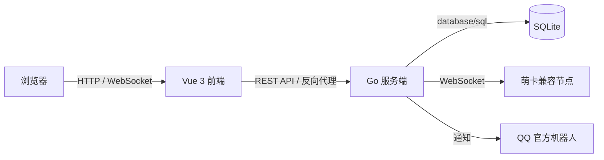

# QQ Pet

一个面向 QQ 宠物的 Web 管理平台。项目提供用户与钱包体系、QQ 账号接入、宠物资料与互动、自动托管、自动 PK，以及配套的后台管理能力。

> [!IMPORTANT]
> 本项目仍在持续开发中，接口和数据结构可能发生变化。涉及 QQ 账号、Token、Cookie 等敏感信息时，请仅在可信环境中部署，并在使用前自行评估风险。

## 功能概览

### 用户端

- 注册、登录、退出、会话恢复和密码修改
- 独立金币钱包、转账记录、卡密兑换
- QQ 账号添加、登录、续期和安全验证
- 宠物资料、属性、每日统计和战力排行
- 喂养、洗澡、互动、学习、工作和冒险
- 好友列表、好友宠物资料和互动
- 宠物 PK、对手缓存及自动 PK
- 自动喂养、自动洗澡、自动互动和计划任务
- 公告、操作状态和执行日志

### 管理端

- 用户、角色、状态和钱包管理
- 注册配置、系统设置和审计日志
- QQ 套餐、QQ 绑定与服务期限管理
- 卡密生成、查询和统计
- 公告与陌生宠物数据管理
- 萌卡/机器人节点配置、连接状态和 WebSocket 调试
- 官方机器人推送配置

## 项目架构



项目采用前后端分离的单仓库结构。发布版本中的 `qq-pet-frontend` 是一个轻量 Go 启动器：它内嵌 Vue 构建产物，并将 `/api`、`/healthz` 和 `/ws` 请求反向代理到服务端。

## 技术栈

| 模块 | 技术 |
| --- | --- |
| 服务端 | Go、Chi、`database/sql` |
| 数据库 | SQLite（`modernc.org/sqlite`，无需 CGO） |
| 鉴权 | HttpOnly Cookie Session、bcrypt |
| 实时通信 | Gorilla WebSocket |
| 前端 | Vue 3、TypeScript、Vite |
| UI 与状态 | Element Plus、Pinia、Vue Router |
| 其他 | QRCode、UUID |

## 目录结构

```text
qq-pet/
├─ backend/
│  ├─ cmd/server/                 # 服务端入口
│  ├─ internal/
│  │  ├─ admin/                   # 后台管理业务
│  │  ├─ announcement/            # 公告业务
│  │  ├─ auth/                    # 认证、会话与权限
│  │  ├─ autocontrol/             # 宠物自动托管调度器
│  │  ├─ autopk/                  # 自动 PK 调度器
│  │  ├─ config/                  # 服务配置
│  │  ├─ database/                # SQLite 连接与迁移
│  │  ├─ logstream/               # 实时日志推送
│  │  ├─ mokant/                  # 萌卡兼容节点适配层
│  │  ├─ officialbot/             # QQ 官方机器人通知
│  │  ├─ response/                # 统一 API 响应
│  │  ├─ server/                  # HTTP 路由与业务接口
│  │  ├─ timeutil/                # 时间工具
│  │  └─ wallet/                  # 钱包与金币流水
│  └─ data/                       # 运行时数据库（不要提交）
├─ frontend/
│  ├─ public/                     # 静态资源与验证页面
│  ├─ src/
│  │  ├─ api/                     # API 请求封装
│  │  ├─ components/              # 公共组件
│  │  ├─ layouts/                 # 用户端、管理端和认证布局
│  │  ├─ router/                  # 前端路由
│  │  ├─ stores/                  # Pinia 状态
│  │  └─ views/                   # 用户端与管理端页面
│  ├─ main.go                     # 静态资源服务器与反向代理
│  ├─ package.json
│  └─ vite.config.ts
├─ .gitignore
└─ README.md
```

## 环境要求

- Go 1.26 或更高版本
- Node.js 20.19+ 或 22.12+
- npm

## 从源码运行

### 1. 启动服务端

```powershell
cd backend
go mod download
go run ./cmd/server
```

首次启动时，程序会依次要求输入：

1. 服务端监听端口（建议填写 `2345`，与前端默认配置一致）
2. 初始管理员用户名
3. 初始管理员密码

配置会保存到 `backend/data/qq-pet.db`。后续启动将直接读取数据库，不再重复询问。

### 2. 启动前端开发服务器

```powershell
cd frontend
npm ci
npm run dev
```

浏览器访问 `http://127.0.0.1:5173`。

当前 `frontend/vite.config.ts` 中的开发代理默认指向本机 `2345` 端口：

```ts
proxy: {
  '/api': { target: 'http://127.0.0.1:2345', changeOrigin: true },
  '/healthz': { target: 'http://127.0.0.1:2345', changeOrigin: true },
  '/ws': { target: 'ws://127.0.0.1:2345', changeOrigin: true, ws: true },
}
```

## 运行发布版

请分别打开两个终端，先启动服务端，再启动前端。以下示例假设服务端端口为 `2345`：

```powershell
# 终端 1
./qq-pet-server.exe

# 终端 2
$env:FRONTEND_PORT = "5173"
$env:NO_OPEN = "0"
./qq-pet-frontend.exe
```

前端启动器支持以下环境变量：

| 变量 | 默认值 | 说明 |
| --- | --- | --- |
| `BACKEND_URL` | `http://127.0.0.1:2345` | 服务端地址 |
| `FRONTEND_HOST` | `127.0.0.1` | 前端监听地址；如需局域网访问可显式设为 `0.0.0.0` |
| `FRONTEND_PORT` | `5173` | 前端监听端口 |
| `NO_OPEN` | `1` | 设为非 `1` 时尝试自动打开浏览器 |

> [!NOTE]
> SQLite 文件按服务端的当前工作目录写入 `./data/qq-pet.db`。请从固定目录启动服务端，并定期备份 `data` 目录。

## 构建

构建服务端：

```powershell
cd backend
go build -trimpath -o qq-pet-server.exe ./cmd/server
```

构建前端及其启动器：

```powershell
cd frontend
npm ci
npm run build
go build -trimpath -ldflags "-s -w -X main.version=0.2.6" -o qq-pet-frontend.exe .
```

交叉编译时可按目标平台设置 `GOOS` 和 `GOARCH`。SQLite 驱动不依赖 CGO。

## 测试与检查

```powershell
cd backend
go test ./...

cd ../frontend
npm run build
```

后端测试覆盖认证、数据库迁移、钱包、服务端接口、自动托管和自动 PK 等核心模块；前端目前以 TypeScript 类型检查和生产构建作为基础检查。


## 致谢与项目关系

本项目在 QQ 机器人接入思路、功能设计和使用体验等方面借鉴了 [萌卡 NT（Mengka-NT）](https://github.com/Carlor-Official/Mengka-NT)。感谢原项目作者及贡献者的探索与开源分享。

本项目为独立实现，并非萌卡 NT 官方项目或官方分支。使用、修改或分发相关项目内容时，请分别遵守各自仓库的开源许可证；“QQ”等名称及相关商标归其权利人所有。

## 免责声明

本项目仅供学习、研究和技术交流使用，不提供任何可用性、稳定性或账号安全保证。使用者应自行承担部署和使用风险，并遵守所在地法律法规及相关平台服务协议。请勿将本项目用于破坏服务、侵犯他人权益或其他违法违规用途。

## 开源许可

本项目采用 [MIT License](LICENSE) 开源。你可以将本项目用于商业用途，也可以使用、复制、修改、合并、发布、分发、再许可或销售本项目的副本，但必须保留原始版权声明和许可声明。
